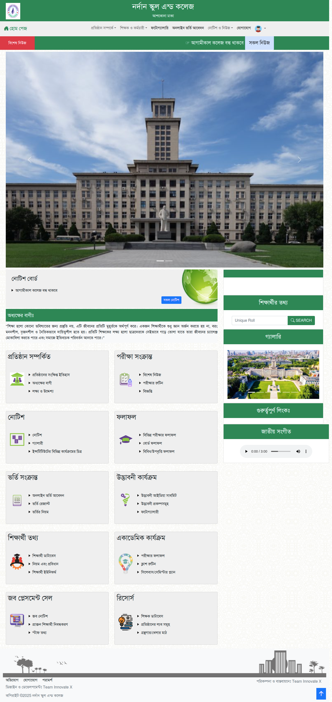

# Education Institute Management System

A **web-based Education Institute Management System** built using **Python Django**, **HTML**, **CSS**, and **Bootstrap**. This system provides dynamic content management and role-based dashboards for Students, Teachers, Staff, and IT Officers.

## Features

* **Landing Page**: Professional, responsive, and dynamic landing page.
* **Role-Based Dashboards**:

  * **Student Dashboard**: View results, routines, notifications.
  * **Teacher Dashboard**: Manage classes, assignments, and student results.
  * **Staff Dashboard**: Handle administrative tasks like registration and fee management.
  * **IT Officer Dashboard**: System monitoring and maintenance.
* **Dynamic Content**: All data fetched and managed dynamically using Django models and templates.
* **Responsive Design**: Fully responsive UI using Bootstrap for desktop, tablet, and mobile.
* **Notifications & Alerts**: Stay updated with important notices, events, and announcements.
* **Secure Authentication**: Role-based login and access control.

## Technologies Used

* **Backend**: Python, Django
* **Frontend**: HTML5, CSS3, Bootstrap
* **Database**: SQLite / PostgreSQL
* **Tools**: Django Admin, Visual Studio Code / PyCharm

## Installation

1. **Clone the repository**:

```bash
git clone https://github.com/your-username/education-institute-management-system.git
cd education-institute-management-system
```

2. **Create a virtual environment**:

```bash
python -m venv venv
source venv/bin/activate  # Linux/macOS
venv\Scripts\activate     # Windows
```

3. **Install dependencies**:

```bash
pip install -r requirements.txt
```

4. **Apply migrations**:

```bash
python manage.py makemigrations
python manage.py migrate
```

5. **Create a superuser** (for admin access):

```bash
python manage.py createsuperuser
```

6. **Run the development server**:

```bash
python manage.py runserver
```

7. Open your browser and navigate to `http://127.0.0.1:8000/`

## Project Structure

```
education_institute_management_system/
│
├── accounts/              # User authentication & roles (students, teachers, staff, IT)
├── dashboard/             # Role-based dashboards
├── templates/             # HTML templates
├── static/                # CSS, JS, images
├── manage.py
└── requirements.txt
```

## Screenshots



## Contributing

Contributions are welcome! Please fork the repository and submit a pull request.

## License

This project is licensed under the MIT License. See the [LICENSE](LICENSE) file for details.

## Author

**Team Inovate X** – [GitHub Profile](https://github.com/amirhamjacse)
